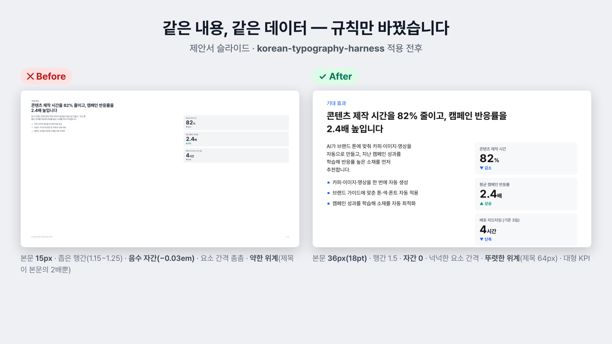
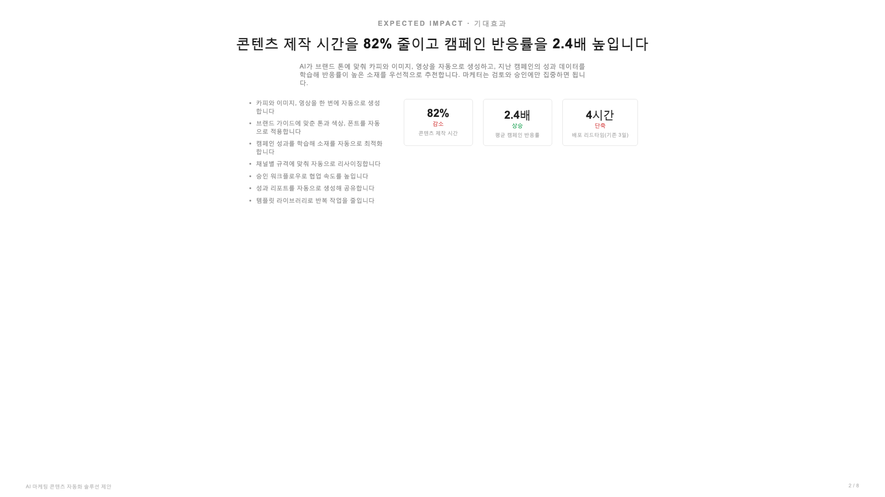
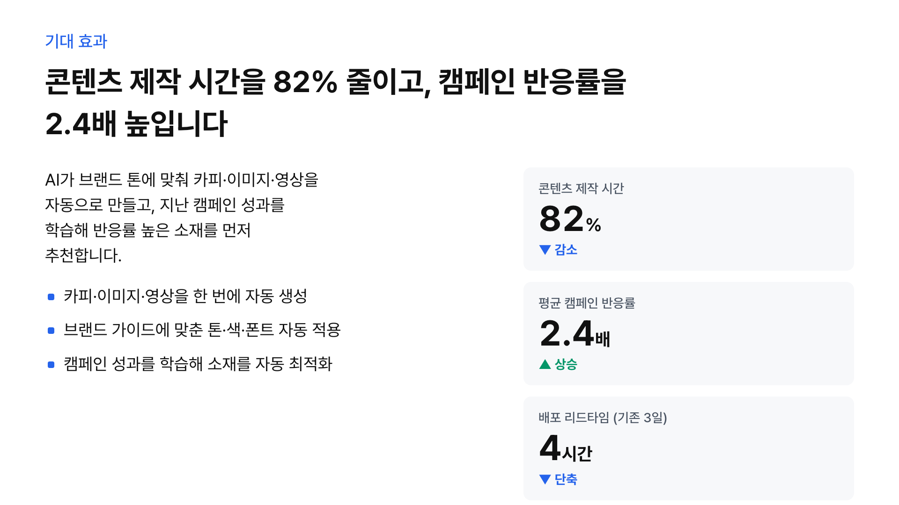
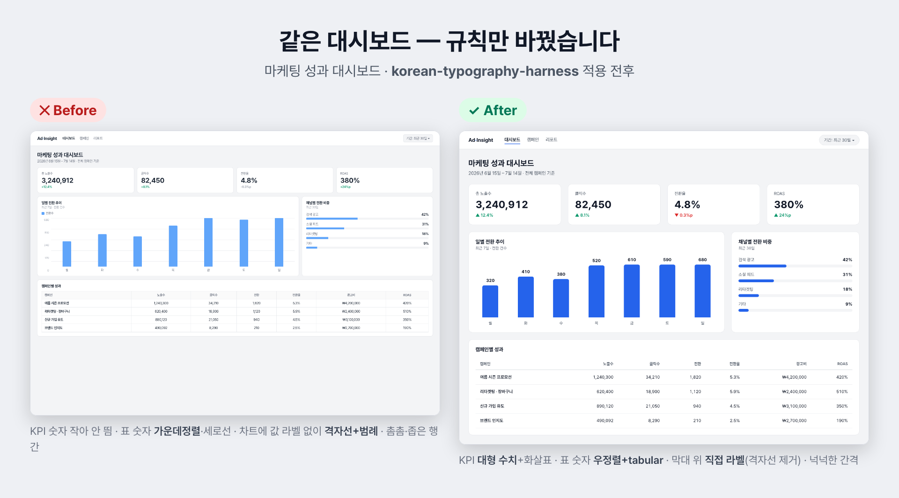
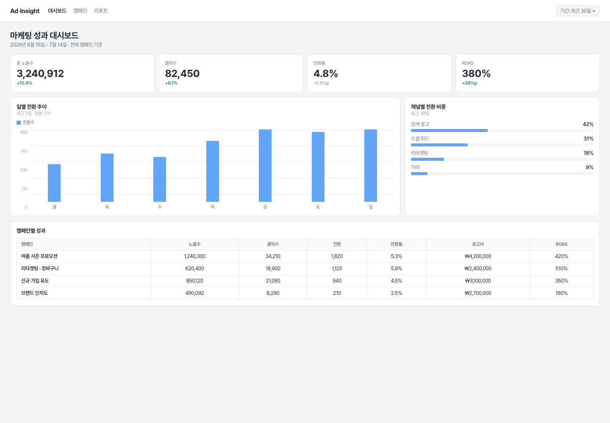
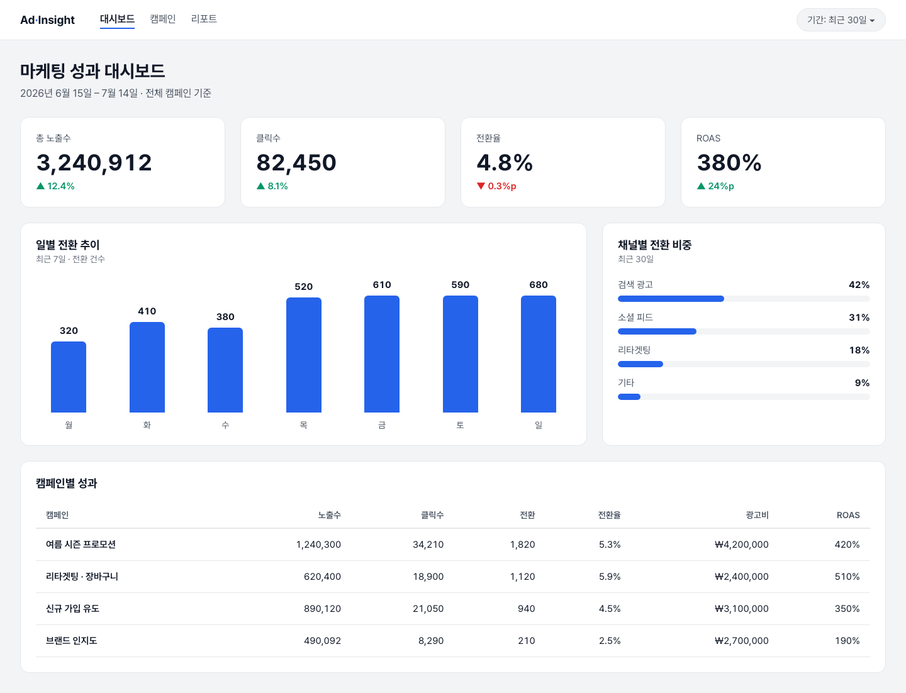

# korean-typography-harness

**한글로 만든 웹사이트·앱·제안서를 "예쁘고 자연스럽고 전문가가 만든 것처럼" 보이게 도와주는 도구예요.**

혹시 이런 경험 있으세요? 직접 만든 화면인데… 왠지 싸구려 같고, 촌스럽고, 어딘가 어설퍼 보였던 경험 있으신가요? 

**한글은 영어와 글자 구조가 완전히 달라요.** 한글은 '가·나·다'처럼 네모난 블록이 빽빽하게
이어져서, 영어와 똑같은 크기·간격으로 쓰면 **금방 답답하고 빡빡해 보여요.**
그런데 세상 대부분의 웹 템플릿·디자인은 영어를 기준으로 만들어져 있어요.
그래서 거기에 한글만 부으면 **"외국 옷에 억지로 끼워 넣은 느낌"**이 나는 거예요.

좋은 한글 화면은 **정해진 규칙**에서 나와요. 
예를 들면, 본문 글씨는 16~17px, 줄 간격은 글자의 1.5배 이상, 한 줄에 24~34글자, 제목·버튼은 단어가 중간에서
잘리지 않게… 이런 수치들이죠. 

그래서 이 규칙들을(한국 정부 디자인 표준 KRDS, 웹 접근성 표준 WCAG 등 **믿을 만한 근거**에서 뽑아)
AI에게 통째로 심어 놔서 harness로 구축했어요. 

---

## 📸 적용 예시 — Before / After

아래는 **내용·데이터·폰트·레이아웃을 똑같이 두고** 규칙만 적용한 결과예요.

### 예시 1 · 제안서 슬라이드



| | ✕ Before | ✓ After |
|---|---|---|
| 본문 크기 | 15px (투사 화면엔 너무 작음) | **36px (18pt)** |
| 위계(대비) | 제목이 본문의 2배뿐 — 뭉갬 | 제목 64px · 본문 36px — 뚜렷 |
| 행간(줄 간격) | 1.15~1.25 (답답) | 1.5 |
| 자간 | −0.03em (글자 붙음) | 0 |
| 요소 간 간격 | 촘촘 (숨 막힘) | 넉넉 (4·8 스케일) |
| 지표(KPI) | 38px · 라벨 12px | **76px** · 큰 라벨 |

<details>
<summary>각 화면 크게 보기 (풀 1920×1080)</summary>

**✕ Before — 제대로 만든 듯하지만 간격·행간·자간·위계가 어긋난 상태**



**✓ After — korean-typography-harness 적용**



</details>

### 예시 2 · 마케팅 대시보드



| | ✕ Before | ✓ After |
|---|---|---|
| 지표(KPI) 숫자 | 24px — 작아서 안 띔 | **36px** — 한눈에 |
| 표 숫자 정렬 | 가운데 정렬 (자릿수 어긋남) | **오른쪽 정렬 + 고정폭 숫자** |
| 표 모양 | 세로 구분선으로 갇힘 | 가로선만 (숨통) |
| 차트 값 읽기 | 격자선·범례로 눈 왕복 | **막대 위 직접 라벨** |
| 본문/행간 | 12~13px · 1.25 | 15~16px · 1.6 |
| 카드 간격 | 촘촘 | 넉넉 (24px) |

<details>
<summary>각 화면 크게 보기 (풀 1440px)</summary>

**✕ Before — 작은 위계 · 격자선 차트 · 가운데정렬 표**



**✓ After — korean-typography-harness 적용**



</details>

> 두 예시 모두 재현 가능해요 — 원본 HTML은 [`examples/`](examples/)에 있습니다.

---

## 🙋 이런 분들을 위해 만들었어

- 📄 한글 **홈페이지·랜딩페이지**를 만들었는데 어딘가 촌스러워 보이는 분
- 🌍 **외국 템플릿**을 가져왔는데 한글을 넣으니 답답하고 어색한 분
- 📊 한글 **대시보드·차트·표**를 만들었는데 정신없고 프로 같지 않은 분
- 🎤 한글 **제안서·발표자료**가 뒷자리에서 안 읽히거나 밋밋한 분
- 🤖 AI로 만든 화면이 **"AI가 만든 티"**가 나서 다듬고 싶은 분
- ✅ 내가 만든 화면이 **규칙에 맞는지 검사**받고 싶은 분


---

## 🚀 설치 (복붙 3단계)

> **먼저 [Claude Code](https://claude.com/claude-code)가 필요해요.** (없다면 링크에서 설치 — 무료로 시작 가능)
> Claude Code를 연 다음, 아래 파란 글씨(명령어)를 **그대로 복사해서 붙여넣기** 하면 됩니다.

**1단계 —**

```
/plugin marketplace add moonkey48/korean-typography-harness
```

**2단계 —** 

```
/plugin install korean-typography-harness@korean-typography-harness
```

**3단계 —** Claude Code를 **껐다가 다시 켜요.** 

이제 설치가 완료되었습니다. 아래 예시를 복붙해서 써보세요 👇

---

## 💬 이렇게 쓰세요 (복붙해서 쓰는 예시)

아래 문장을 **복사해서 Claude Code에 붙여넣고**, `[  ]` 부분만 여러분 상황에 맞게 바꾸면 돼요.
어렵게 쓸 필요 없어요. 평소 말하듯 부탁하면 알아서 규칙을 지켜 만들어 줍니다.

### 🆕 새로 만들기

```
카페 홍보용 한글 랜딩페이지를 만들어줘. [매장 소개, 메뉴, 오시는 길] 내용이 들어가고,
따뜻하고 신뢰감 있게, 전문가가 만든 것처럼 자연스럽게 보이면 좋겠어.
```
> 💡 한글에 맞는 글씨 크기·줄 간격·여백·색을 알아서 적용해 화면을 만들어 줘요.

### 🌍 외국 템플릿 / 영어 화면을 한글에 맞게 바꾸기

```
이 영어 템플릿을 한글에 맞게 바꿔줘. 한글이 답답해 보이지 않고 자연스럽게: [파일 또는 주소]
```
> 💡 "한글만 부어서 어색한" 문제를 규칙에 맞게 고쳐 줘요.

### ✅ 내 화면이 규칙에 맞는지 검사받기

```
내가 만든 이 한글 화면이 디자인 규칙에 맞는지 검사하고, 고칠 점을 알려줘: [파일 또는 주소]
```
> 💡 글씨가 너무 작진 않은지, 색 대비가 잘 보이는지, 확대해도 안 깨지는지 등을 짚어 줘요.

### 🤖 "AI가 만든 티" / 촌스러움 걷어내기

```
이 화면이 AI로 대충 만든 것처럼 촌스러워. 어색하고 싸구려 같은 부분을 찾아서 고쳐줘: [파일 또는 주소]
```
> 💡 흔한 "AI 티 나는" 디자인 습관을 찾아 전문가스럽게 다듬어 줘요.

### 📊 대시보드 · 차트 · 표

```
우리 회사 매출을 보여주는 한글 대시보드를 차트랑 표 포함해서 만들어줘.
```
> 💡 차트가 정신없지 않게, 숫자가 깔끔하게 정렬되게 만들어 줘요.

### 🎤 제안서 · 발표자료

```
아래 내용으로 한글 제안서 슬라이드를 만들어줘. 발표장 뒷자리에서도 잘 읽히게: [제안 내용]
```
> 💡 발표 화면에 맞는 큰 글씨·정렬로, 회의실 뒤에서도 읽히게 만들어 줘요.

### ❔ 그냥 궁금할 때 (수치 질문)

```
한글 홈페이지에서 본문 글씨는 몇 px가 적당해? 이유도 알려줘.
```
> 💡 "정답 수치"와 그 근거를 알려 줘요.

---

## 📦 무엇이 들어있나요 (알아서 챙겨주는 것들)

설치하면 아래 능력들이 AI에게 생겨요. **여러분이 일일이 고를 필요는 없어요** — AI가 상황을 보고
알아서 필요한 걸 씁니다. (궁금한 분들을 위한 목록이에요.)

| 이런 걸 챙겨줘요 | 무슨 뜻이냐면 |
|---|---|
| 📐 **정확한 수치의 기준** | 글씨 크기·간격·색·대비의 "정답"을 모두 여기서 가져와요 (근거 있는 규칙집) |
| 🧭 **알아서 배정** | 여러분 요청을 보고 어떤 전문가를 부를지 정해줘요 (진입점) |
| 🏗️ **화면 짜임새** | 홈페이지·앱·대시보드의 뼈대와 여백을 한글에 맞게 |
| 🎨 **색·글씨 세팅** | 규칙에 맞는 색·글씨를 코드로 자동 정리 |
| 📊 **차트·표** | 정신없지 않고 깔끔하게 읽히는 그래프와 표 |
| 🎤 **제안서 슬라이드** | 발표장에서 잘 읽히는 한글 슬라이드 |
| ✍️ **글·문구 다듬기** | 한글 문장이 자연스럽게, 어절이 안 잘리게 |
| 🔍 **검사·QA** | 규칙 위반(작은 글씨, 안 보이는 색 등)을 잡아냄 |
| 🧹 **촌스러움 제거** | "AI 티/싸구려 느낌" 나는 부분을 걸러냄 |
| 🖼️ **첫 화면 비주얼** | 랜딩페이지 맨 위 큰 이미지+제목을 멋지게 |


### 직접 도구 호출하기

| 하고 싶은 것 | 명령 |
|---|---|
| 한글 UI 전반(생성/한글화/검수) | `/korean-design-apply` |
| "정답 수치" 조회 | `/korean-design-foundation` |
| 촌스러움 제거 | `/bamti-removal` |
| 규칙 준수 검증 | `/korean-design-checks` |
| 토큰/테마 셋업 | `/korean-design-tokens` |
| 첫 화면 히어로 | `/hero-visual-art-direction` |

### 함께 쓰면 더 좋은 것 (선택 · 서드파티, 미동봉)

| 도구 | 용도 | 출처 |
|---|---|---|
| `korean-skills` (humanizer·grammar·style) | 한글 문구 품질 — AI 번역투 제거·맞춤법·문체 통일 | [DaleSeo/korean-skills](https://github.com/DaleSeo/korean-skills) (MIT) |
| `hallmark` | 안티-AI-슬롭 시각 구조 | [Nutlope/hallmark](https://github.com/Nutlope/hallmark) |
| `oklch-skill` | 색 변환·팔레트·대비 | — |

`korean-skills` 설치: `/plugin marketplace add DaleSeo/korean-skills` → `/plugin install korean-skills`

### Codex 호환

일부 스킬에 `agents/openai.yaml`이 포함돼 Codex/OpenAI 에이전트에서도 쓸 수 있어요.

---

## English summary

**korean-typography-harness** is a Claude Code plugin that teaches the AI the exact rules for
making **Korean-language** websites, apps, and slides look natural and professional — not like a
foreign template with Hangul poured in. Korean's square syllable blocks read denser than Latin, so
the same sizes and spacing feel cramped; this harness applies evidence-based Korean type/spacing/
color/contrast rules (from KRDS, WCAG, etc.) automatically. **You just ask in Korean.**

**Install:** `/plugin marketplace add moonkey48/korean-typography-harness` →
`/plugin install korean-typography-harness@korean-typography-harness` → restart Claude Code.

Contains 10 skills + 6 agents. Skills are Korean-language; runs anywhere Claude Code skills run.

## 라이선스

MIT © 2026 [moonkey48](https://github.com/moonkey48). 자세한 내용은 [LICENSE](LICENSE).
누구나 자유롭게 쓰고 수정하고 배포할 수 있어요.
