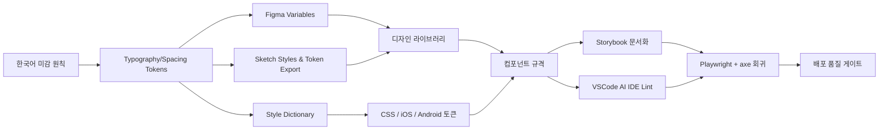
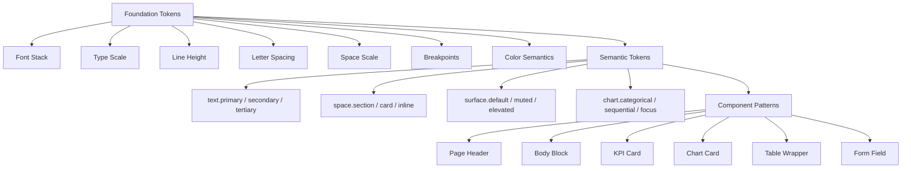
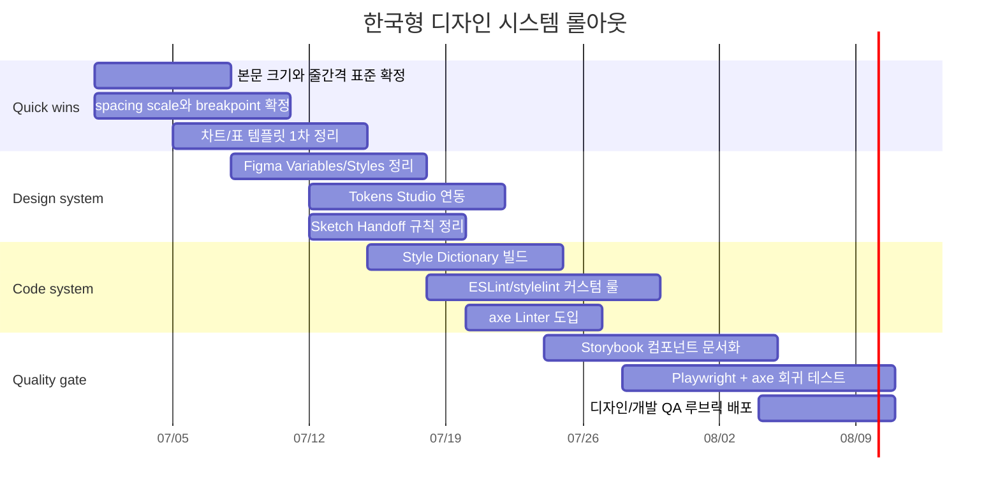

# 한국 디자이너를 위한 바이브코딩 시대의 보편 설계 스킬셋과 한국형 UI 타이포그래피 시스템

## 요약

이 보고서는 **한국어 UI에서 반복적으로 발생하는 “외국 템플릿의 어색함”**을 줄이기 위해, 한국 디자이너가 바이브코딩 환경에서도 일관되게 사용할 수 있는 **보편 설계 스킬셋, 수치 규칙, 토큰 구조, 자동 검수 체계**를 제안한다. 전제는 명확하다. **타깃 사용자, 산업군, 브랜드 톤은 별도 제약이 없는 것으로 가정**하며, 따라서 기본 톤은 한국 서비스에서 가장 범용적으로 쓰이는 **중립적·업무형·정보 중심**으로 둔다. 이때 기준 서체는 한국어 가독성과 다국어 혼합에 강한 **Pretendard 계열과 Noto Sans KR 계열**을 중심으로 보고, 플랫폼 규칙은 **KRDS, WCAG, Android Material, Apple HIG**를 종합한다. citeturn25view0turn7search2turn5view4turn4view3turn13view5turn29search3

핵심 결론은 네 가지다. 첫째, 한국어 UI는 같은 명목 크기라도 **라틴 중심 템플릿보다 1단계 큰 본문 크기와 더 여유 있는 줄간격**이 안정적이다. KRDS는 본문을 최소 16px 이상으로 보되, Pretendard GOV는 상대적으로 작게 보이므로 **기본 17px**을 사용한다고 밝히며, 줄간격은 **최소 150% 이상**을 권고한다. citeturn5view4turn5view3

둘째, 한국어의 시각적 쾌적함은 “화려한 스타일”보다 **밀도 제어**에서 나온다. 즉 **자간은 거의 0, 제목과 본문 크기 차는 1.25~1.5배, 최소 16px 이상의 가터, 24px 안팎의 화면 마진, 명확한 계층과 절제된 색 수**가 더 중요하다. KRDS는 heading/body 차이를 1.25~1.5배로 권고하고, 레이아웃은 small 구간 4–6컬럼, medium 8–12컬럼, large 12–16컬럼을 제시한다. Material 역시 8dp 간격 체계와 적응형 레이아웃을 권장한다. citeturn5view0turn4view3turn32search0turn33view6

셋째, “한국형 미감”은 취향 문제가 아니라 **규칙을 토큰화하고 검사 가능한 상태로 만드는 것**에 가깝다. Figma Variables와 Dev Mode는 변수와 코드 스니펫 연결을 지원하고, Tokens Studio는 Figma 변수와 토큰을 연동해 저장소와 동기화할 수 있으며, Style Dictionary는 토큰을 CSS·iOS·Android 등 여러 플랫폼으로 내보낼 수 있다. 여기에 Storybook, axe Linter, Playwright, ESLint/stylelint 커스텀 룰을 붙이면 바이브코딩이 생성한 코드까지 검수 범위에 넣을 수 있다. citeturn15search6turn17search13turn15search17turn16search5turn15search5turn28search1turn18search2turn16search3turn18search5

넷째, 실무 도입 순서는 **“타이포 토큰 → 간격 토큰 → 컴포넌트 라이브러리 → 자동 검사 → CI/회귀 테스트”**가 가장 효율적이다. 특히 빠른 효과를 내려면 먼저 **본문 17px/16px 규격화, line-height 1.55~1.6 통일, 컬럼·가터·마진 규격화, 차트·표 규칙 템플릿화, 접근성 대비 검사 자동화**부터 시행하는 것이 좋다. 이 순서는 큰 조직이 아니어도 4~8주 안에 MVP 수준으로 정착시키기 쉽다. citeturn5view4turn5view3turn4view3turn39view0turn36view0turn28search5

## 연구 범위와 전제

이 보고서는 “한국 디자이너가 한국어 중심 서비스·문서·제품을 만들 때, 해외 템플릿을 그대로 쓰면 왜 어색해지는가”를 **타이포그래피·레이아웃·도구·검수·운영 체계** 관점에서 분석한다. 별도의 브랜드 성격, 고객군, 업종, B2B/B2C 제약은 명시되지 않았으므로, 기본값은 **범용 정보 서비스와 제안 문서에 모두 적용 가능한 기본 체계**로 두었다. 즉 공격적 브랜딩보다는 **가독성, 신뢰성, 단정함, 유지보수성**을 우선한다. 이 전제는 KRDS의 공공형 기준, Apple/Material의 플랫폼 기본 원칙, WCAG 접근성 원칙과 잘 맞는다. citeturn5view4turn4view3turn11search3turn12search5turn22search12

서체 기본축은 **Pretendard Variable / Pretendard / Noto Sans KR / Apple SD Gothic Neo / Malgun Gothic** 순의 fallback stack을 권장한다. Pretendard는 크로스 플랫폼과 다국어 타이포그래피에서 자연스러운 현대적 글꼴로 설계되었고, 가독성과 시각 보정을 위해 추가 작업을 덜 요구한다고 공식 문서가 설명한다. 또한 Pretendard는 공공 서비스 환경용 Pretendard GOV를 별도로 제시한다. Noto Sans KR는 한국어를 위한 산세리프로 Hangul과 Hanja를 지원한다. citeturn25view0turn7search2

따라서 이 보고서의 수치 규칙은 “해외 템플릿을 그대로 가져오는 방식”이 아니라, **한국어 본문 밀도와 혼합 문자 환경을 고려해 KRDS 최소치보다 약간 실무 친화적으로 보정한 운영 규격**이다. 즉 일부 값은 규격의 직접 복제가 아니라 **공식 가이드의 하한·권장값을 바탕으로 한 설계 제안**이며, 표 안의 수치는 그런 의미에서 “정책 숫자”가 아니라 **팀 표준 숫자**로 읽는 것이 맞다. citeturn5view0turn5view3turn4view3turn33view6turn29search3turn13view5

## 한국어 맥락의 미감 원칙과 필수 스킬셋

한국어 UI가 예쁘게 보이는 첫 번째 조건은 **“작지 않음”**이다. KRDS는 모든 사용자가 쉽게 읽도록 본문을 **최소 16px 이상**으로 설정해야 하며, Pretendard GOV는 같은 16px라도 상대적으로 작게 느껴져 **기본 17px**을 사용한다고 설명한다. 이 한 줄이 사실상 한국어 UI의 기본 방향을 알려준다. 한국어는 네모꼴 음절 블록이 연속되기 때문에, 라틴 중심 템플릿의 14~16px 본문과 좁은 leading을 그대로 가져오면 금방 답답해진다. 따라서 한국어 UI는 **본문을 16~17px에서 시작**하고, 정보 밀도가 높은 화면만 15px로 내려가는 것이 안전하다. citeturn5view4

두 번째 조건은 **줄간격의 여유**다. KRDS는 line-height를 **최소 150% 이상**으로 두고 상대 단위를 쓰라고 권고한다. Apple 역시 여러 줄 텍스트에는 **tight leading을 피하라**고 안내하고, Microsoft는 PowerPoint 접근성 가이드에서 줄·단락 사이에 충분한 여백을 두고, 양끝정렬 대신 **왼쪽 정렬**을 권장한다. 즉 한국어 본문은 **1.5 이하로 내려갈 때 시각적 쌓임이 빨라지고**, 특히 표·카드·설명문에서 피로감이 커진다. 실무 표준으로는 본문 1.55~1.6, 긴 문장 1.6~1.7, 디스플레이급 제목 1.3~1.45가 안정적이다. citeturn5view3turn31search17turn35search1

세 번째는 **자간을 거의 건드리지 않는 것**이다. KRDS의 본문·타이틀·네비게이션·라벨 토큰 대부분은 **letter-spacing 0px**이고, 큰 display와 일부 heading만 1px을 둔다. 이는 한국어에서 라틴 UI처럼 전역 tracking을 벌리는 습관이 대체로 좋지 않다는 강한 신호다. 한국어는 글자 블록 자체가 이미 분명하므로, 전역 +tracking은 텍스트를 “세련되게” 만들기보다 종종 “성기고 어수선하게” 만든다. 따라서 **본문과 UI 라벨은 0em**, 큰 타이틀만 **0 ~ -0.01em**, 디스플레이급 짧은 헤드라인도 **0 ~ -0.015em 범위**에서만 미세 조정하는 것이 좋다. citeturn6view3turn25view0

네 번째는 **빈 공간의 규칙성**이다. KRDS는 small 구간 최소 마진 16px, medium 이상 24px, 가터는 최소 16px·권장 24px을 제시한다. Material은 전체 간격 체계를 **8dp 스케일**로 설명한다. 따라서 한국어 UI는 “느낌대로 띄우는 여백”보다 **4px 서브그리드 + 8px 매크로 스케일**이 가장 운영하기 쉽다. 즉 4, 8, 12, 16, 24, 32, 40, 48, 64를 기본 간격으로 고정하고, 본문 블록·카드·패널·섹션 간격은 이 계열에서만 선택하도록 제한하는 편이 미감을 빠르게 안정시킨다. citeturn4view3turn32search0turn32search6

다섯 번째는 **계층 대비의 명시성**이다. KRDS는 heading과 body 차이를 **1.25~1.5배**로 설정하는 것이 자연스럽다고 설명한다. 이 말은 곧 한국어 UI에서 “미세한 차이의 여러 텍스트 스타일”이 좋지 않다는 뜻이다. 한국어는 라틴보다 줄 단위 덩어리가 빨리 차 보이므로, 스타일은 많아도 좋지 않고 **크기·두께·간격의 차이가 한눈에 보이는 소수 체계**가 더 낫다. 실무적으로는 **Display / Heading / Title / Body / Label / Caption** 정도로만 역할을 고정하고, 실제 프로젝트에선 6~8개 토큰 이내로 쓰는 것이 유지보수에 유리하다. citeturn5view0turn6view0

여섯 번째는 **색보다 구조가 먼저**라는 점이다. KRDS와 WCAG 기반 가이드는 일반 텍스트 대비 **4.5:1**, 큰 텍스트 **3:1**, 차트와 같은 비텍스트 그래픽 요소는 인접 색상 대비 **3:1**을 요구한다. Government Analysis Function은 차트에서 색 수를 줄이고, 가능하면 **범례보다 직접 라벨링**을 쓰라고 권한다. 즉 한국어 미감에서 색은 “화면을 예쁘게 하는 장식”이 아니라 **정보 구조의 마지막 보정 장치**여야 한다. 너무 많은 accent 색, 과한 채도, 낮은 대비의 회색 본문은 한국어 화면을 가장 쉽게 촌스럽게 만든다. citeturn6view0turn39view0turn39view1turn38view3

이 원칙을 실제 역량으로 바꾸면, 한국 디자이너가 갖춰야 할 보편 스킬셋은 아래처럼 정리할 수 있다. 아래 표의 역량은 단순 취향이 아니라 **토큰화·컴포넌트화·테스트화가 가능한 능력**이어야 한다. citeturn21search11turn27search1turn16search5

| 스킬셋 | 왜 필요한가 | 실무 기준 산출물 |
|---|---|---|
| 한글 타이포 보정 감각 | 같은 16px도 서체마다 다르게 보이고, 한국어는 줄 밀도가 빨리 높아짐 | 본문 16/17px 기준표, 제목-본문 비율표 |
| 한·영·숫자 혼식 설계 | 한국 서비스는 이메일·수치·영문명 혼합 빈도가 높음 | 폰트 stack, 숫자 정렬 규칙, 라벨 예외 규칙 |
| 그리드·여백 체계화 | 어색함의 대부분은 서체보다 spacing에서 발생 | 4/8 기반 space 토큰, breakpoint 표 |
| 데이터 표현 설계 | 차트·표·대시보드는 색보다 구조가 중요 | 차트 시리즈 수 제한, 표 정렬 규칙, 축·범례 규칙 |
| 접근성 내재화 | 확대, 대비, 키보드, 터치 목표 크기까지 고려해야 함 | contrast QA, 200%/400% 확대 테스트, 터치 목표 규칙 |
| 토큰·컴포넌트 모델링 | 바이브코딩 결과를 안정화하려면 규칙을 코드화해야 함 | typography tokens, semantic spacing, component props |
| 자동 검수 설계 | 사람이 보는 미감 검수만으로는 바이브코딩 산출물 제어가 어려움 | lint 규칙, Storybook, axe, Playwright 시나리오 |
| 디자인-개발 협업 | Dev Mode/Handoff에서 같은 말을 써야 함 | 네이밍 룰, Figma/Sketch ↔ code 매핑 문서 |

## 디자인 유형별 수치 규칙

아래 표는 **KRDS의 본문·계층·레이아웃 기준, WCAG 대비 규칙, Material의 8dp와 적응형 breakpoints, Apple/Android의 모바일 규칙, Microsoft의 제안서 접근성 가이드**를 종합해 만든 **운영 권장값**이다. 직접 규격이라기보다, 한국어 맥락에서 즉시 적용 가능한 표준안으로 이해하면 된다. 특히 “해외 템플릿을 그대로 쓸 때”보다 **본문은 대체로 1단계 크게, tracking은 더 보수적으로, 여백은 더 규칙적으로** 잡았다. citeturn5view4turn5view3turn5view0turn4view3turn39view0turn33view6turn14search5turn29search3turn13view5turn35search11turn35search18

| 디자인 유형 | 본문 기본값 | 제목 스케일 권장 | 줄간격 | 자간 | 바깥 여백과 그리드 | 반응형 기준 | 흔한 실패 |
|---|---|---|---|---|---|---|---|
| 제안서 | **18pt** 기본, 라이브 발표는 **24pt 이상** 우선 | 18 / 24 / 32 / 44pt | 본문 **1.35~1.5**, 긴 설명 **1.45~1.55** | 본문 **0**, 큰 제목 **0 ~ -0.01em** | 1920×1080 슬라이드 기준 좌우 **96px**, 상하 **64px**, **12컬럼**, 거터 **24px** | 반응형보다 **투사 거리** 우선 | 14~16pt 본문, 과다 bullet, 양끝정렬, 차트/표 축소 |
| 차트 | 카드 안 기준 라벨 **14px**, 모바일 **13px 이상** | 차트 타이틀 **18~24px**, 수치 강조 **24~40px** | **1.4~1.5** | **0** | 차트 카드 패딩 **24px**, 모바일 **16px** | 모바일 1열, tablet 2열, desktop 3~4열 | 범례 남발, 색 5개 이상, 다중 시계열을 바 차트로 표현, gridline 과다 |
| 표 | 데스크톱 **15px**, 모바일 **14px** | 섹션 제목 **17~19px** | 본문 **1.45~1.6** | **0** | 셀 패딩 **12×16px**, 행 높이 **44~48px**, vertical line 지양 | 좁을 때 카드형 전환 또는 가로 스크롤 + 헤더 고정 | 숫자 좌정렬, 셀 4줄 이상, 모달 안에 큰 표 삽입 |
| 랜딩 페이지 | 데스크톱 **17~18px**, 모바일 **16~17px** | Hero **44/60px**, 섹션 제목 **24/32px** | 본문 **1.55~1.7**, hero **1.2~1.35** | 본문 **0**, hero **-0.01em 내외** | 모바일 **4컬럼**, tablet **8컬럼**, desktop **12컬럼**; 마진 **16 / 24 / 24px** | **360 / 768 / 1024 / 1280 / 1440** | 영문형 과대 tracking, 이미지 위 저대비 카피, 과도한 center text |
| 대시보드 | 데스크톱 **14~16px**, 모바일 **14px** | KPI **28~40px**, 카드 제목 **16~18px** | 본문 **1.45~1.6** | **0** | desktop **12컬럼**, tablet **8**, mobile **4**; 카드 간격 **16~24px** | 모바일 세로 1열, tablet 2열, desktop 3~4열 | 한 페이지에 chart/table 과적재, 내부 스크롤, horizontal scroll |
| 웹 앱 | 본문 **16~17px**, 보조 **14~15px**, 캡션 **13px 이상** | page title **24~32px**, section **19~24px** | 본문 **1.5~1.6**, label **1.4~1.5** | 본문/라벨 **0**, 큰 제목 **0 ~ -0.01em** | KRDS 기준 small **4–6**, medium **8–12**, large **12–16** | **360 / 768 / 1024 / 1280 / 1440** | 12px 보조텍스트, CTA 높이 부족, 컬럼 혼용, 지나친 회색 본문 |
| 모바일 앱 | Body **16pt/sp**, Secondary **13~14pt/sp**, Caption **12~13pt/sp** | title **20~24pt/sp**, screen title **28pt 전후** | 본문 **1.45~1.6**, 긴 설명 **1.55~1.65** | 본문 **0**, 큰 제목 **0 ~ -0.01em** | **4컬럼**, 좌우 **16~20pt/dp**, 요소 간격 **8/12/16** | 앱 창 기준 **Compact <600dp / Medium 600–839 / Expanded 840+** | 12 이하 회색 텍스트, 44/48 미만 터치 목표, Dynamic Type/fontScale 무시 |

이 표에 반드시 붙여야 하는 예외 규칙도 있다. **차트는 일반적으로 4시리즈 이내**, **stacked bar는 스택당 4범주 이내**, **clustered bar는 한 클러스터 4개 막대 이내**, **gridline은 최대 10개 전후**가 좋다. 가능하면 범례보다 직접 라벨링을 쓰고, 표는 **숫자 데이터 오른쪽 정렬 / 텍스트 왼쪽 정렬 / 셀 내 텍스트 3줄 이내**를 지키는 편이 훨씬 읽기 쉽다. 대시보드는 중요 데이터를 먼저 보여주는 **inverted pyramid 구조**, 최소 스크롤, horizontal scrolling 회피, 대형 표는 pagination을 사용하는 방식이 적합하다. citeturn38view0turn38view3turn38view4turn23view1turn36view0

랜딩 페이지와 긴 본문형 웹 콘텐츠는 **행 길이**도 조정해야 한다. Baymard는 본문 가독성에 최적인 line length를 **50~75자**로 제시한다. 한국어는 글자 블록 밀도가 더 높아 체감 행 길이가 빨리 길어지므로, 이를 그대로 옮기기보다 **대략 24~34자 한글 문장, 혹은 45~65자 혼합 텍스트**로 조금 짧게 잡는 편이 안전하다. 이 값은 공식 규격이라기보다 위 연구에서 도출한 **한국어용 운영 추정치**다. citeturn24search1

모바일과 웹 앱에서는 터치 목표 크기와 확대 대응을 별도 규칙으로 묶어야 한다. Android는 상호작용 요소를 **최소 48dp × 48dp**, Apple은 일반적으로 **최소 44pt × 44pt**를 권한다. 또한 대시보드와 웹 콘텐츠는 확대 시 텍스트와 레이아웃이 깨지지 않아야 하며, Government Analysis Function은 dashboard 텍스트를 **최소 12pt 또는 그에 준하는 크기**로 보라고 권고한다. 실무적으로는 한국어 UI에서 이 하한만 맞추기보다 **본문 16 기준으로 시작하고, 터치 요소는 44/48 이하로 내리지 않는 것**이 낫다. citeturn13view5turn29search3turn36view0

## 툴링과 자동화

바이브코딩 환경에서는 “좋은 감각”보다 **좋은 제약조건**이 더 중요하다. 즉 디자이너가 아무리 한국어 미감을 잘 알아도, 프롬프트로 생성된 코드가 다시 영문형 spacing과 breakpoints를 가져오면 결과는 흔들린다. 따라서 툴링은 반드시 **디자인 단계, 핸드오프 단계, 코드 생성 단계, 렌더 후 테스트 단계**로 나눠 설계해야 한다. Figma Variables와 Dev Mode, Sketch의 Handoff와 token export, Style Dictionary, Storybook, axe Linter, Playwright, ESLint/stylelint 커스텀 룰이 이 체계를 구성한다. citeturn15search6turn17search13turn19search2turn20search2turn16search5turn15search3turn28search1turn18search2turn16search3turn18search5

아래 비교표는 “한국형 타이포·간격 규칙을 **어디서 고정하고 무엇으로 검사할 것인가**”에 초점을 맞춘다. 기능 수보다 **한글 규칙을 강제할 수 있는지**가 핵심이다. citeturn17search0turn17search4turn15search17turn28search5

| 도구 | 주 용도 | 장점 | 한계 | 도입 포인트 |
|---|---|---|---|---|
| **Figma Variables + Dev Mode** | 색·숫자 변수, 개발 inspect | Figma 네이티브, Dev Mode에서 변수 코드 확인 가능 | 복잡한 typography 토큰/파일 동기화는 별도 체계 필요 | 먼저 space/color/breakpoint를 변수화하고 inspect 규칙 문서화 |
| **Figma Color Contrast Checker** | 디자인 단계 대비 검수 | 네이티브, 빠름 | 대비 외 타이포 규칙은 못 잡음 | 모든 텍스트·버튼 상태 대비를 초기에 검수 |
| **Tokens Studio for Figma** | 토큰 관리·저장소 동기화 | Figma 변수와 함께 토큰을 중앙 관리, semantic token에 강함 | 러닝커브와 운영 규율 필요 | typography/spacing/semantic token을 Git 기반으로 관리 |
| **Stark for Figma** | 디자인 단계 접근성 감사 | 디자인에서 접근성 이슈를 빠르게 발견 | 실제 런타임/키보드/DOM 검수는 아님 | 색 대비·포커스·초기 접근성 점검 전용으로 사용 |
| **Sketch Color Variables + Handoff Token Export** | Sketch 기반 시스템 관리 | 공식적으로 Color/Text/Layer Style token export 지원 | 변수 범위가 Figma 대비 좁고, 팀 운영은 추가 스크립트 필요 | Sketch 계속 쓸 팀은 공식 Handoff + custom plugin 조합 |
| **Style Dictionary** | 토큰을 CSS/iOS/Android로 빌드 | 멀티플랫폼 출력의 표준 도구 | 초기 셋업 필요 | DTCG/JSON 토큰을 앱·웹 패키지로 배포 |
| **Storybook + addon-a11y** | 컴포넌트 UI 문서화·접근성 테스트 | 컴포넌트 단위 회귀와 문서화에 강함 | 페이지 흐름 전체는 별도 테스트 필요 | 디자인 시스템 컴포넌트의 공식 정답 수립 |
| **axe Accessibility Linter** | 코드 작성 중 정적 접근성 검사 | VS Code와 Cursor/Windsurf 같은 AI IDE에서 사용 가능 | spacing/미감 자체는 못 잡음 | 바이브코딩 생성 코드의 즉시 필터로 사용 |
| **ESLint 커스텀 룰** | JSX/TSX 토큰 강제 | “본문 16 미만 금지”, “하드코딩 간격 금지” 같은 룰 작성 가능 | 프런트엔드 팀 유지보수 필요 | 텍스트/컴포넌트 prop의 금지 패턴 관리 |
| **stylelint 커스텀 플러그인** | CSS/SCSS 토큰 강제 | raw px, 임의 line-height, 임의 margin 남용을 차단 | CSS-in-JS 환경이면 추가 전략 필요 | spacing/type token 외 값 사용 금지 |
| **Playwright + axe** | 렌더 후 E2E + 접근성 회귀 | 실제 렌더 상태로 검사 가능 | 속도가 느리고 시나리오 설계 필요 | 대시보드·폼·표·모바일 뷰 회귀 테스트 |

도입 순서를 도식으로 요약하면 다음과 같다. 핵심은 **디자인 원칙이 바로 코드 제한 조건으로 이어져야 한다**는 점이다. citeturn15search6turn16search5turn28search1turn15search5turn18search2



실제 통합은 어렵지 않다. Figma 쪽은 **Variables로 space/color/breakpoint를 먼저 정리**하고, Typography는 Tokens Studio로 semantic token을 겹친 뒤, Dev Mode에서 토큰 이름이 개발용 변수명과 같게 보이도록 네이밍을 맞춘다. 조직 보안이 필요한 경우 Figma는 **관리자 승인 플러그인 정책**을 둘 수 있어, Tokens Studio·Stark 같은 승인 도구만 허용하는 운영이 가능하다. citeturn15search6turn15search17turn17search13turn17search2turn17search15

코드 쪽은 Style Dictionary로 웹·iOS·Android용 배포 패키지를 만들고, VS Code/AI IDE에는 axe Accessibility Linter를 설치한다. Deque 문서는 이 linter가 **VS Code 호환 에디터와 Cursor, Windsurf 같은 AI IDE**에서도 동작한다고 설명한다. 여기에 ESLint/stylelint 커스텀 룰로 **임의 px 값, 16px 미만 본문, 토큰 외 spacing 사용**을 금지하면, 바이브코딩이 생성한 결과물이 곧바로 팀 규칙 안으로 들어온다. citeturn16search5turn28search1turn28search7turn16search3turn18search5

Storybook과 Playwright는 마지막 안전장치다. Storybook은 컴포넌트를 분리해 문서화하고, addon-a11y로 접근성 검사를 함께 돌릴 수 있다. Playwright는 렌더된 결과에 axe를 주입해 실제 화면에서 문제를 잡는다. 즉 Storybook은 **컴포넌트 정답집**, Playwright는 **운영 전 회귀 검수**라고 보면 된다. citeturn15search1turn15search5turn15search20turn18search2turn16search6

## 한국형 패턴 라이브러리와 토큰 구조

패턴 라이브러리는 “컴포넌트 모음”이 아니라, **한국어 텍스트가 들어왔을 때 망가지지 않는 조합의 집합**이어야 한다. 그래서 최소 구성은 Button/Input/Card 같은 일반 컴포넌트보다, **본문 블록, 설명형 리스트, KPI 카드, 차트 카드, 테이블 래퍼, 헤더-본문-보조문 조합**이 더 중요하다. KRDS도 typography를 display/heading/body와 semantic token으로 관리하고, 디자인 토큰은 semantic token과 component token을 구분하며 padding/margin에 **-x/-y 네이밍**을 권장한다. citeturn6view3turn21search11

권장 패턴 묶음은 다음 여섯 가지다. **Page Header**, **Section Header**, **Body Block**, **KPI Card**, **Chart Card**, **Table Wrapper**다. 이 여섯 개만 잘 설계해도 제안서·랜딩·대시보드·웹앱의 70% 이상을 커버할 수 있다. 여기서 중요한 것은 컴포넌트의 외형보다 **텍스트 슬롯의 역할 고정**이다. 예를 들어 KPI Card는 `eyebrow / metric / delta / help` 4슬롯, Chart Card는 `title / subtitle / chart / description / source / download` 6슬롯처럼 정의해야 대체 텍스트와 다운로드 링크까지 일관되게 넣을 수 있다. 이는 차트에 대체 설명·소스·데이터 다운로드를 제공하라는 공공 분석 가이드와도 맞닿아 있다. citeturn37view0turn36view0

아래 구조는 한국형 컴포넌트 관계를 간략히 보여준다. 핵심은 **타이포 토큰과 간격 토큰이 각 컴포넌트의 구조 슬롯을 지배**하고, 모든 시각적 결정이 이 토큰을 통과하도록 만드는 것이다. citeturn21search11turn27search1turn16search5



아래는 **DTCG 친화형 JSON 예시**다. Design Tokens Community Group은 토큰 교환용 파일 포맷을 표준화하고 있고, Style Dictionary는 해당 포맷을 지원한다. 따라서 장기적으로는 Figma/Sketch에서 쓰는 값과 코드값을 이 포맷에 맞추는 것이 유리하다. citeturn27search1turn27search5turn27search12turn16search5

```json
{
  "$description": "Korean-first design tokens",
  "font": {
    "family": {
      "sans": {
        "$type": "fontFamily",
        "$value": "\"Pretendard Variable\", Pretendard, -apple-system, BlinkMacSystemFont, \"Apple SD Gothic Neo\", \"Noto Sans KR\", \"Malgun Gothic\", sans-serif"
      }
    },
    "weight": {
      "regular": { "$type": "fontWeight", "$value": 400 },
      "medium": { "$type": "fontWeight", "$value": 500 },
      "bold": { "$type": "fontWeight", "$value": 700 }
    },
    "size": {
      "caption": { "$type": "dimension", "$value": "13px" },
      "label": { "$type": "dimension", "$value": "14px" },
      "body": { "$type": "dimension", "$value": "17px" },
      "bodyDense": { "$type": "dimension", "$value": "15px" },
      "title": { "$type": "dimension", "$value": "24px" },
      "headline": { "$type": "dimension", "$value": "32px" },
      "display": { "$type": "dimension", "$value": "44px" }
    },
    "lineHeight": {
      "caption": { "$type": "number", "$value": 1.45 },
      "label": { "$type": "number", "$value": 1.45 },
      "body": { "$type": "number", "$value": 1.6 },
      "title": { "$type": "number", "$value": 1.45 },
      "headline": { "$type": "number", "$value": 1.4 },
      "display": { "$type": "number", "$value": 1.3 }
    },
    "tracking": {
      "caption": { "$type": "dimension", "$value": "0em" },
      "label": { "$type": "dimension", "$value": "0em" },
      "body": { "$type": "dimension", "$value": "0em" },
      "title": { "$type": "dimension", "$value": "-0.01em" },
      "headline": { "$type": "dimension", "$value": "-0.01em" },
      "display": { "$type": "dimension", "$value": "-0.015em" }
    }
  },
  "space": {
    "4": { "$type": "dimension", "$value": "4px" },
    "8": { "$type": "dimension", "$value": "8px" },
    "12": { "$type": "dimension", "$value": "12px" },
    "16": { "$type": "dimension", "$value": "16px" },
    "24": { "$type": "dimension", "$value": "24px" },
    "32": { "$type": "dimension", "$value": "32px" },
    "40": { "$type": "dimension", "$value": "40px" },
    "48": { "$type": "dimension", "$value": "48px" },
    "64": { "$type": "dimension", "$value": "64px" }
  },
  "breakpoint": {
    "sm": { "$type": "dimension", "$value": "360px" },
    "md": { "$type": "dimension", "$value": "768px" },
    "lg": { "$type": "dimension", "$value": "1024px" },
    "xl": { "$type": "dimension", "$value": "1280px" },
    "xxl": { "$type": "dimension", "$value": "1440px" }
  },
  "color": {
    "text": {
      "primary": { "$type": "color", "$value": "#111111" },
      "secondary": { "$type": "color", "$value": "#4B5563" },
      "tertiary": { "$type": "color", "$value": "#6B7280" }
    },
    "surface": {
      "default": { "$type": "color", "$value": "#FFFFFF" },
      "muted": { "$type": "color", "$value": "#F7F8FA" }
    }
  }
}
```

웹 구현용 SCSS는 아래처럼 아주 단순하게 시작하는 편이 좋다. 핵심은 **임의 값 사용을 줄이고 semantic class 또는 utility를 강제로 통과시키는 것**이다. citeturn16search5turn18search5turn16search3

```scss
:root {
  --font-sans: "Pretendard Variable", Pretendard, -apple-system, BlinkMacSystemFont,
    "Apple SD Gothic Neo", "Noto Sans KR", "Malgun Gothic", sans-serif;

  --fs-caption: 13px;
  --fs-label: 14px;
  --fs-body: 17px;
  --fs-body-dense: 15px;
  --fs-title: 24px;
  --fs-headline: 32px;
  --fs-display: 44px;

  --lh-caption: 1.45;
  --lh-label: 1.45;
  --lh-body: 1.6;
  --lh-title: 1.45;
  --lh-headline: 1.4;
  --lh-display: 1.3;

  --ls-default: 0em;
  --ls-tight: -0.01em;
  --ls-tighter: -0.015em;

  --sp-4: 4px;
  --sp-8: 8px;
  --sp-12: 12px;
  --sp-16: 16px;
  --sp-24: 24px;
  --sp-32: 32px;
  --sp-40: 40px;
  --sp-48: 48px;
  --sp-64: 64px;
}

@mixin type-body {
  font-family: var(--font-sans);
  font-size: var(--fs-body);
  line-height: var(--lh-body);
  letter-spacing: var(--ls-default);
  font-weight: 400;
}

@mixin type-title {
  font-family: var(--font-sans);
  font-size: var(--fs-title);
  line-height: var(--lh-title);
  letter-spacing: var(--ls-tight);
  font-weight: 700;
}

.page-copy {
  @include type-body;
  max-width: 32rem; // 한국어는 긴 행 길이를 피하는 편이 안정적
}

.kpi-value {
  font-family: var(--font-sans);
  font-size: var(--fs-display);
  line-height: var(--lh-display);
  letter-spacing: var(--ls-tighter);
  font-weight: 700;
}

.table-cell {
  font-family: var(--font-sans);
  font-size: var(--fs-body-dense);
  line-height: 1.5;
  letter-spacing: 0;
  padding: var(--sp-12) var(--sp-16);
}
```

실무에서 자주 쓰는 **한국형 재사용 컴포넌트**는 아래처럼 정의하면 된다. `PageHeader`, `SectionHeader`, `BodyBlock`, `KpiCard`, `ChartCard`, `TableWrapper`, `FieldGroup`, `EmptyState`, `FilterBar`, `MetricDelta`가 기본 세트다. 이 중 `ChartCard`와 `TableWrapper`는 반드시 **description/source/download** 슬롯이 있어야 하고, `BodyBlock`은 본문 폭 최대값을 가져야 한다. 그렇지 않으면 외국 템플릿처럼 화면이 넓어질수록 행 길이가 지나치게 길어져 한국어 가독성이 무너진다. citeturn24search1turn37view0turn23view1

## 체크리스트와 구현 로드맵

운영 단계에서 가장 중요한 것은 “완성 느낌”이 아니라 **검수 가능성**이다. 아래 체크리스트는 디자이너와 개발자가 같이 쓰도록 만든 것이다. 각 항목은 되도록 **숫자 기준 + 검사 도구 + 통과/실패 판정**으로 정의해야 한다. citeturn13view5turn39view0turn36view0turn28search1turn18search2

| 검수 항목 | 통과 기준 | 권장 검사 도구 |
|---|---|---|
| 본문 크기 | 웹/앱 본문 **16px·16sp·16pt 이상**, 예외는 dense table만 **15** | 디자인 리뷰 + ESLint/stylelint |
| 줄간격 | 본문 **1.5 이상**, 긴 문단 **1.6 내외** | Figma style audit + CSS lint |
| 자간 | 한글 본문/라벨 **0em 기본**, 전역 positive tracking 금지 | 디자인 토큰 검사 |
| 제목 대비 | 제목/본문 비율 **1.25~1.5배** 유지 | typography token diff |
| 마진/가터 | 토큰 값만 사용, small **16**, medium+ **24** 기본 | stylelint custom plugin |
| 대비 | 일반 텍스트 **4.5:1**, 큰 텍스트 **3:1**, 비텍스트 그래픽 **3:1** | Figma checker, Stark, axe |
| 확대 대응 | 200% 확대 시 내용/기능 손실 없음, 대시보드는 400%도 확인 | 브라우저 zoom, Playwright |
| 터치 목표 | iOS **44pt**, Android **48dp** 이상 | 기기 시뮬레이터/Inspector |
| 차트 시리즈 수 | 일반 **4시리즈 이내**, stacked **4범주 이내**, gridline **10 이하** | 수동 리뷰 + 차트 템플릿 |
| 표 규칙 | 숫자 우정렬, 텍스트 좌정렬, 셀 3줄 이내, vertical line 지양 | 컴포넌트 QA |
| 대시보드 구조 | 중요 지표 상단, horizontal scroll 지양, 큰 표 pagination | UX/QA 리뷰 |
| 코드 일관성 | raw px/hex 직접 사용 최소화, token 참조 강제 | ESLint/stylelint + PR review |

디자인과 개발이 같은 문장을 쓰기 위해, **PR 템플릿과 디자인 리뷰 템플릿도 함께 바꿔야** 한다. PR에는 “토큰 외 spacing 사용 여부”, “본문 16 미만 여부”, “차트 대체 설명 여부”, “table alignment 여부”, “200% 확대 체크 여부”를 넣고, 디자인 리뷰에는 “한글 자간 오버튜닝 여부”, “표·차트 카드 슬롯 충족 여부”, “행 길이 초과 여부”를 넣는 편이 좋다. 이 정도만 해도 ‘감’에 의존하던 검수가 상당 부분 구조화된다. citeturn16search3turn18search5turn37view0turn23view1turn36view0

우선순위는 **빠른 체감 개선**과 **장기 유지보수의 분리**로 잡는 것이 맞다.  
빠른 개선은 다음 세 가지다. **본문 17/16 규격화**, **spacing scale 통일**, **차트·표 템플릿 규칙화**다. 이것만으로도 ‘영문형 UI 느낌’이 크게 줄어든다.  
그다음은 **토큰 저장소와 Style Dictionary 빌드**, **Figma/Sketch handoff 정리**, **VS Code lint 도입**이다.  
장기 과제는 **Storybook 문서화**, **Playwright 회귀 테스트**, **조직 차원의 plugin approval와 design QA rubric 표준화**다. citeturn5view4turn4view3turn16search5turn28search1turn15search20turn17search2

실행 일정은 아래처럼 가져가면 무리가 적다. 2026년 7월 1일을 시작점으로 놓으면, **2주 안에 토큰 MVP**, **4주 안에 디자인 라이브러리 정리**, **6~8주 안에 코드 검수 체계**까지 들어갈 수 있다. citeturn15search17turn16search5turn28search5turn18search2



최종적으로 추천하는 **MVP 산출물**은 다섯 개다.  
첫째, **Korean Typography Tokens v1**.  
둘째, **Space & Grid Tokens v1**.  
셋째, **ChartCard / TableWrapper / KpiCard 컴포넌트 세트**.  
넷째, **VS Code lint 규칙 + axe 설정**.  
다섯째, **디자인 QA 체크리스트와 PR 템플릿**이다.  
이 다섯 개가 준비되면, 이후 바이브코딩이 만들어내는 결과물은 더 이상 “외국 템플릿의 한글화”가 아니라, **한국어 UI 규칙 안에서 생성되는 변형**으로 바뀐다. 그 지점에서 비로소 미감은 개인 취향이 아니라 **시스템 품질**이 된다. citeturn21search11turn27search1turn16search5turn28search1turn15search5